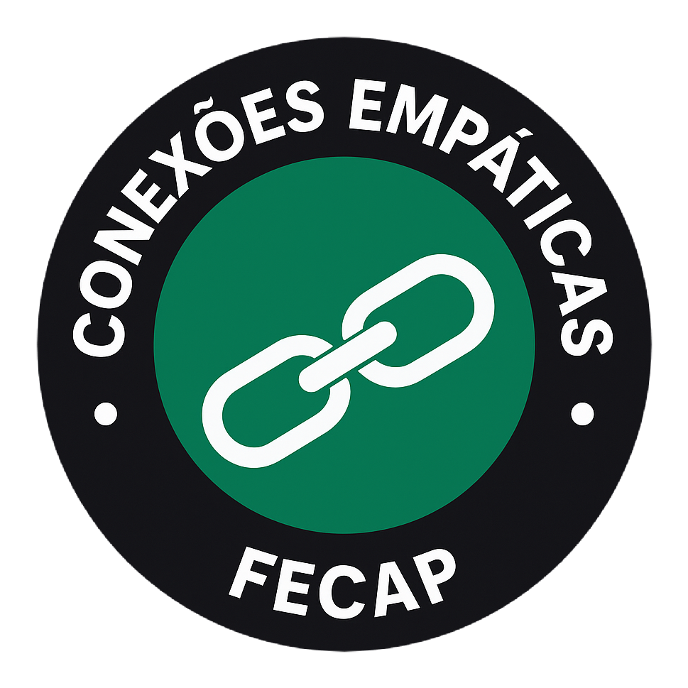

# FECAP - Fundação de Comércio Álvares Penteado

<p align="center">
<a href= "https://www.fecap.br/"></a>
</p>

# Conexões Empáticas

## WebCrawler´s

## Integrantes: <a href="https://github.com/GuilhermeMonteiro14">Guilherme Monteiro Da Silva</a>, <a href="https://github.com/DebatingAlpaca">João Pedro Da Silva</a>, <a href="https://github.com/Santos-raphael">Raphael De Oliveira Santos</a>, <a href="https://github.com/StefanyO8">Stefany Samira De Oliveira Cubertino</a>

## Professores Orientadores: <a href="https://www.linkedin.com/in/cristina-machado-corr%C3%AAa-leite-630309160" target="_blank"> Cristina Machado Corrêa Leite</a>, <a href="https://www.linkedin.com/in/dolemes/" target="_blank"> David de Oliveira Lemes</a>, <a href="https://www.linkedin.com/in/francisco-escobar/" target="_blank"> Francisco de Souza Escobar </a>, <a href="https://www.linkedin.com/in/katia-bossi/" target="_blank"> Kátia Bossi </a>, <a href="https://www.linkedin.com/in/leonardo-fabris-lugoboni-a3369416/?originalSubdomain=br" target="_blank"> Leonardo Fabris Lugoboni</a>

## Descrição

<p align="center">
  
  
</p>


<p>
O Projeto Lideranças Empáticas é uma iniciativa coordenada pelo professor Jésus Gomes e idealizada por alunos do 1º semestre da FECAP. Seu objetivo principal é arrecadar alimentos para doação a pessoas em situação de vulnerabilidade social, promovendo solidariedade, engajamento e impacto positivo na comunidade.
  
Nosso projeto consiste no desenvolvimento de uma plataforma digital inovadora que tem como objetivo facilitar a gestão e o acompanhamento do projeto Lideranças Empáticas. A ferramenta foi criada para oferecer uma experiência completa e intuitiva, permitindo que alunos, mentores e administradores organizem ações solidárias de forma eficiente e transparente.

Entre suas principais funcionalidades, a plataforma possibilita o acompanhamento detalhado das doações, com gráficos e relatórios que mostram em tempo real o que está sendo arrecadado. Também oferece controle de datas e cronogramas, garantindo que os grupos cumpram seus prazos e metas. Além disso, conta com um espaço interativo para que os alunos publiquem atualizações e fotos das doações recebidas, promovendo engajamento e troca de experiências.

Para os administradores, a plataforma disponibiliza um painel completo que permite visualizar o crescimento de todos os grupos, monitorar o cumprimento das metas e analisar os tipos de itens arrecadados. Essa estrutura garante transparência, incentiva a colaboração e fortalece a conexão entre teoria e prática, contribuindo para a formação de líderes engajados e socialmente responsáveis.

</p>

##  Protótipo navegável no Figma
<a href="https://www.figma.com/design/d6d58QWVq8z9luoTVgzR7V/WebCrawler-s?node-id=48-2&t=Ak4S9BNHtQX5Ntdp-1">Protótipo navegável</a>

##  Link para o site
<a href="https://projeto-interdisciplinar-webcrawlers.vercel.app/">Link para o site</a>

## login e senha para testar:
Aluno: 12345 (Login para RA)  senha:123456 <br/>
Admin/Mentor: admin@test.com senha:123456


## 🛠 Estrutura de pastas

<pre>
├── Raiz
│
├── Imagens
│
├── src
|   ├── Backend
|   └── Frontend
|
├── Documentos
│   ├── Entrega 1
│   │   ├── Entrega Cálculo 2
│   │   ├── Entrega Desenvolvimento Web Full Stack
│   │   ├── Entrega Gestão Empresarial e Dinâmicas das Organizações
│   │   ├── Entrega Projetos em Banco de Dados
│   │   └── Entrega Projeto Interdisciplinar: Programação Web
│   └── Entrega 2
│       ├── Entrega Cálculo 2
│       ├── Entrega Desenvolvimento Web Full Stack
│       ├── Entrega Gestão Empresarial e Dinâmicas das Organizações
│       ├── Entrega Projetos em Banco de Dados
│       └── Entrega Projeto Interdisciplinar: Programação Web
│
└── README.md
</pre>


<b>README.MD</b>: Arquivo que serve como guia e explicação geral sobre seu projeto. O mesmo que você está lendo agora.

Há também X pastas que seguem da seguinte forma:

<b>src</b>: Pasta que contém o código fonte.

<b>Documentos</b>: Pasta com todos os documentos importantes do Site.

<b>Entregas 1</b>: Todas as entregas para o dia 22 de Setembro, de todas as materias, estará nesta pasta.

<b>Entregas 2</b>: Todas as entregas para o dia 10 de Novembro, de todas as materias, estará nesta pasta.


## 🛠 Instalação


<b>Windows:</b>

Não há instalação! Apenas executável!


## 💻 Configuração para Desenvolvimento

Para abrir este projeto você necessita das seguintes ferramentas:

-<a href="https://code.visualstudio.com/">VSCode</a><br>
-<a href="https://nodejs.org/pt">Node.js</a><br>
```sh
Dentro da pasta Backend:
npm install
npx nodemon server.js
Dentro da pasta Frontend:
npm install
npm start
```


## 📋 Licença/License
<a href="https://github.com/2025-2-MCC2/Projeto7/tree/main">Conexões Empáticas</a> © 2025 by <a href="https://github.com/2025-2-MCC2">Guilherme Monteiro Da Silva, João Pedro Da Silva, Raphael De Oliveira Santos, Stefany Samira De Oliveira Cubertino</a> is licensed under <a href="https://creativecommons.org/licenses/by/4.0/">Creative Commons Attribution 4.0 International</a>
<br/>

## 🎓 Referências

Aqui estão as referências usadas no projeto.

1. <https://link>
2. <https://link>
3. <https://link>
4. <https://link>
5. <https://link>
6. <https://link>
7. <https://link>
8. <https://link>

